# Dongming's Development Log

## Table of Contents
- [Dongming's Development Log](#dongmings-development-log)
  - [Table of Contents](#table-of-contents)
  - [Feburary 12, 2024](#feburary-12-2024)
    - [Project Design: Project Components](#project-design-project-components)
  - [Feburary 16, 2024](#feburary-16-2024)
    - [Project Design: Component Update](#project-design-component-update)
  - [February 20, 2024](#february-20-2024)
    - [Project Design: Motor Choice](#project-design-motor-choice)
  - [Feburary 27, 2024](#feburary-27-2024)
    - [MCU Code: Begin](#mcu-code-begin)
  - [March 02, 2024](#march-02-2024)
    - [MCU Code: MCU Pin Info and Driver Usage](#mcu-code-mcu-pin-info-and-driver-usage)
  - [March 04, 2024](#march-04-2024)
    - [MCU Code: Code Struture and MCU Pin Assignments](#mcu-code-code-struture-and-mcu-pin-assignments)
  - [March 09, 2024](#march-09-2024)
    - [MCU Code: Wireless Communication Code](#mcu-code-wireless-communication-code)
  - [March 13, 2024](#march-13-2024)
    - [MCU Code: Wireless Communication Testing Part 1](#mcu-code-wireless-communication-testing-part-1)
  - [March 16, 2024](#march-16-2024)
    - [MCU Code: FSMs](#mcu-code-fsms)
  - [March 26, 2024](#march-26-2024)
    - [Debug Customized PCB: Unable to Upload code to MCU with USB-to-UART](#debug-customized-pcb-unable-to-upload-code-to-mcu-with-usb-to-uart)
  - [March 29 to March 31, 2024](#march-29-to-march-31-2024)
    - [MCU Code: Motor Control - PID tunning](#mcu-code-motor-control---pid-tunning)
  - [April 05, 2024](#april-05-2024)
    - [PCB Testing: PCB v1](#pcb-testing-pcb-v1)
  - [April 08, 2024](#april-08-2024)
    - [PCB Testing: PCB v1 motor driver port two](#pcb-testing-pcb-v1-motor-driver-port-two)
    - [Project Design: Minor Update on Physical Design](#project-design-minor-update-on-physical-design)
  - [April 10, 2024](#april-10-2024)
    - [Project Production: Assembling and Testing](#project-production-assembling-and-testing)
  - [EXTRA NOTE](#extra-note)

## Feburary 12, 2024
### Project Design: Project Components

Ready-to-serve trash bin has two big systems
- Motion and Object Detection System
- Trash Bin Control System

**Motion and Object Detection System:**
| Component     | Usage       |
| :---------    | :---------- |
| Raspberry Pi  | Image processing and communication with Trash Bin Control System  |
| Pi Camera     | Image Capturing        |

The Raspberry Pi Models I considered using:
- Raspberry Pi 4B RAM 4GB or 8GB
- Raspberry Pi 5 RAM 4GB or 8GB

Alternative to Raspberry Pi:
- OrangePi 4 / 5 with RAM 4GB or 8GB

If Raspberry Pi is not powerful enough, then the following would be considered:
- Nvidia Jetson board
- Intel processor single board computer
  
<br>

**Trash Bin Control System:**
| Component             | Usage       |
| :---------            | :---------- |
| [ESP32S3 WROOM 1 N16 ](https://www.espressif.com/sites/default/files/documentation/esp32-s3-wroom-1_wroom-1u_datasheet_en.pdf) | Wireless communication, control and drive motors with PWM signals |
| [L298N](https://www.digikey.com/en/products/detail/stmicroelectronics/L298N/585918) | Motor driver chip for amplifying the PWM from MCU based on the reference volatge |
| 12V DC Gear Motors (reversible)   | Move the trash bin on the floor |
| 12V Linear Actuator (reversible)  | Open and close trash bin's lid  |

ESP32S3 WROOM 1 has a built-in wireless communication module; it is a good fit for this project. This MCU is part of the ESP32 S-series.<br>
***The alternative MCUs*** are still based on ESP32 but are in different series, for example, C-series or H-series.

The Motor driver chip L298N is very popular. One chip can control up to 2 DC motors. L298N supports up to a rated voltage of 40V and a max current of 2A, which is more than enough. L298N is hard to solder due to its package. Also, L298N is relatively expensive. <br>
***The alternative motor drivers*** are [A4950](https://www.digikey.com/en/products/detail/allegro-microsystems/A4950ELJTR-T/2626340) or [DRV8870](https://www.digikey.com/en/products/detail/texas-instruments/DRV8870DDAR/5455925). Both have wide operating ranges. The drawback is that each motor driver can only control 1 motor.

The 12V linear actuator only does 3 motions: open, hold, and close. Position tracking is not necessary, so the 12V linear actuator only needs to has two terminals.

The 12V DC Motors needs to provide speed tracking interfaces. One mechanism of speed tracking will be to used hall encoders. 

The power subsystems for these two big systems are ignored. My teammate will come with the power circuit/subsystem for the project.

**TODO:**
- Finalize all components for this project (not including battery)
- Learn how to detect speed using hall encoders
- Skim through the data sheet of ESP32S3 and get familiar with the pins on ESP32S3

## Feburary 16, 2024
### Project Design: Component Update

**Updates:**
- Raspberry Pi 4B with 4 GB. The system is Raspberry Pi OS (64-bit)
- Camera module (5M pixel somana camera module with OV5647)
- Power for Raspberry Pi: Raspberry Pi 4 official charger
- 12V linear actuator is finalized. The part and its purchase link are updated in the component list. 
- 12V DC motors are finalized. The part and its purchase link are updated in the component list. JGB37-520 Hall Encoder Miniature Brushed DC Motor (178 RPM).

The MCU code will be developed on a development board with ESP32S3-WROOM-1-N8 module. For motor drivers, I will use the L298N breakout boards. 

Tentative setup for the project testing:
| Components | Quantity |
| :--------- | -------: |
| ESP32S3-WROOM-1 Dev Board | 1 |
| L298N module | 2 |
| Breadboard | 1 |
| Jumper wires | 30 |

Note: the jumper wires might be a bit more, but they are for rewiring.

## February 20, 2024
### Project Design: Motor Choice

The motor needs to provide enough power to move the bin. Therefore, we need to come up with a minimum theoretical power of a motor.

|  Variable  | Comment                                                          |
|:---------- |:-----------------------------------------------------------------|
| $\tau_{w}$ | torque of a motor (in Nm)                                        |
| $R_{w}$    | wheel radius (in m)                                              |
| $\mu_{w}$  | static friction coefficient of the wheel against the floor       |
| $\mu_{c}$  | static friction coefficient of the metal caster against the floor|
| $m_{T}$    | total mass (in kg)                                               |
| $F_{N}$    | normal force (in N)                                              |
| $F_{wf}$    | static friction of the wheel (in N)                              |
| $F_{cf}$   | static friction of the mastern (in N)                            |
| $g$        | gravitational acceleration constant (m/s<sup>2</sup>)            |

Two DC gear motors at the same position can provide:

$2\tau_{w}=F_{wf} * R_w$

In rolling without slipping, the static friction of the wheels cannot exceed the static friction of the total mass. With two type of wheels (one in rubber, and the other in metal), we have:

$F_{wf} \leq F_N * (\mu_w + \mu_c)$

Using Newton's Second Law:

$F_g = m_T * g$

since the bin does not accelerate up and/or down, $F_g = F_N$

Therefore, the static friction of the total mass is:

$m_T * g * (\mu_w+\mu_c)$

Combing the inequality:

$\frac{2\tau_w}{R_w} \leq m_T * g * (\mu_w + \mu_c)$

$\frac{2\tau_w}{R_w * g * (\mu_w + \mu_c)} \leq m_T$

The wheel radius of our wheel is about 0.0762 m. Assuming that the static coefficients of both wheels are approximately 0.5, and the total mass is about 2.3kg to 2.8kg, we need both motors to provide a torque of at least 0.373 Nm.

Also, we want the bin to move at human walking speed, which should be no more than 1.2 m/s. 

$\text{motor RPM} \leq \frac{1.2 * 60}{\pi * d}$

Based on the theoretical result, the motor we picked previously might not be able to move the bin. So we switch to JGB37-520 Hall Encoder Miniature Brushed DC Motor (60 RPM).

## Feburary 27, 2024
### MCU Code: Begin

MCU code quick break down:
- Motor control module
    - DC motors
    - linear actucator
- Wireless communication module
    - WiFi
    - Service API

The DC motors need to use 5 pins (`PWM`, `D1`, `D2`, `HALL_A`, `HALL_B`)
| Pin Name  | Description |
| :-------: | :---------- |
| `PWM` | PWM signal to the motor driver|
| `D1`  | Direction control 1 (for H-bridge) to the motor driver|
| `D2`  | Direction contorl 2 (for H-bridge) to the motor driver|
| `HALL_A` | Hall encoder phase A from the motor|
| `HALL_B` | Hall encoder phase B from the motor|
  
The linear actuator need to use 3 pins (`PWM`, `D1`, `D2`)
| Pin Name  | Description |
| :-------: | :---------- |
| `PWM` | PWM signal to the motor driver|
| `D1`  | Direction control 1 (for H-bridge) to the motor driver|
| `D2`  | Direction contorl 2 (for H-bridge) to the motor driver|

**Quick Review on H-bridge:** <br>

<br>
`Q1` and `Q4` are controlled by one of the `D`'s; `Q2` and `Q3` are controlled by the other `D`. If `Q1 = Q4 = HIGH` and `Q2 = Q3 = LOW` makes the motor turn clockwise (assuming), then `Q1 = Q4 = LOW` and `Q2 = Q3 = HIGH` makes the motor turn counterclockwise.

In [L298N](https://www.st.com/content/ccc/resource/technical/document/datasheet/82/cc/3f/39/0a/29/4d/f0/CD00000240.pdf/files/CD00000240.pdf/jcr:content/translations/en.CD00000240.pdf), it has two H-bridges. The IN1 and IN2 (or IN3 and IN4) can be mapped to D1 and D2. The MCU can send logic HIGH and LOW via D1 and D2. This effectively controls the state of each pair of switches, similar to the previous description.

**Quick Review on PWM** 
<br>
With PWM control, we can limit the voltage (and current) delivered to the motors and linear actuators. 
<br>
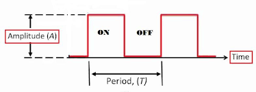

The Duty cycle is the percentage of ON time with respect to the entire period (like the diagram shown above). So,

$\text{Duty Cycle} = \frac{T_{ON}}{T_{Period}}$

and the average voltage over time is

$V_{avg} = \text{Duty Cycle} * V_{amplitude}$

For example, given the max voltage is 12V and the duty cycle is 50%, the average voltage will be 6V. 

With PWM control and constant DC source, we can change the voltage delivered by changing the duty cycle of the PWM signal, allowing the motors and linear actuators to run at different speeds.

**Quick Start on Hall Encoder**

One popular speed measuring method is to use the hall encoders. Most DC motors with hall encoders have two phases: A and B. 

By observing the difference between the two phases, we can determine the direction the motors are turning and approximate the speed of the motors. One method is 

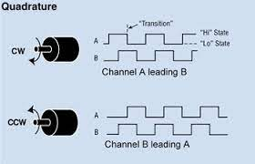

An nice article on Speed Measurement (in Chinese): https://zhuanlan.zhihu.com/p/350368518

I will use the M-method for speed measurements. The unit of speed is RPM.

The computation can be done as the following:

$\text{total pulse count} = \text{PPR} * \text{reduction ratio}$

$\text{output shaft speed} = \frac{\text{pulse count}}{\text{total pulse count}} * \frac{1000}{sample time (ms)} * 60$

This computation will approximate the current speed of the motors (in RPM) based on the pulse counts.

**TODO:**
- Set up wireless communication between the ESP32S3 chip and other edge devices
- Figure out how to control motor using L298N

## March 02, 2024
### MCU Code: MCU Pin Info and Driver Usage

**Quick Check of ESP32S3-WROOM-1**

The official documentation of ESP32S3-WROOM-1: https://www.espressif.com/sites/default/files/documentation/esp32-s3-wroom-1_wroom-1u_datasheet_en.pdf

The technical manual of ESP32S3-WROOM-1: https://espressif.com/documentation/esp32-s3_technical_reference_manual_en.pdf

Some pins might not be available for programming:

For modules with Octal SPI PSRAM, i.e., modules embedded with ESP32-S3R8 or ESP32S3R16V, pins IO35 (GPIO 35), IO36 (GPIO 36), and IO37 (GPIO 37) are connected to the Octal SPI PSRAM and are not available for other uses.

Strapping pins are used to set up the MCU mode:
- Chip boot mode -- GPIO 0 and GPIO 46
- VDD_SPI voltage -- GPIO 45 
- ROM messages printing -- GPIO 46 
- JTAG signal source -- GPIO 3

Section 3.3.1 specifies the download mode setup for the MCU. GPIO 0 needs to be set to logic low to enable Joint Download Boot (maybe we need to have some connections in the schematic to configure the MCU mode)

Section 3.3.4 specifies the setup of the GPIO 3 for enabling JTAG (useful for debugging).

Avoid using GPIO 39 and above. Jtag uses GPIO 39 ~ 41. GPIO 42 and 43 are used for downloading code. We will use a USB-to-UART bridge module to manage auto-download rather than solder a bridge IC on board.

Something need to pay attention when using WiFi ([A useful website](https://nu-ll.github.io/2022/06/05/ESP32%E5%BC%95%E8%84%9A%E4%BD%BF%E7%94%A8%E6%B3%A8%E6%84%8F%E4%BA%8B%E9%A1%B9/))

GPIOs associated with ADC2 channels may be occupied when WiFi is in use. If our MCU cannot read/write to those pins when WiFi is enabled, we need to use some other pins. GPIOs associated with ADC1 channels can be an alternative in case that we need to use the ADC functionalities or use them for other purposes.

ESP32S3 have two different wireless communication method between devices (assuming the other device is not a ESP32 board).
- Bluetooth (normal bluetooth / low power bluetooth)
- WiFi 

The WiFi communication generally has a wider range. So it would be a good option in our case. To make the communication more standardized, I will use HTTP protocols. HTTP protocols are built on top of TCP, and TCP can minimize packet loss in our communication. However, the efficiency of wireless communication might decrease a bit. An alternative would be using UDP. UDP can provide great efficiency under good network conditions but may result in a larger packet loss if the network conditions are not desired.

**L298N setup**

L298N Datasheet: https://www.st.com/resource/en/datasheet/l298.pdf

The L298N is a dual full-bridge driver. Inside L298N, there are two full H-bridge drivers. Previously, I have investigated [how H-bridge works](#mcu-code-begin), I can just connect the IC based on that. Since I was not too familiar with power circuit, I handed this part to my EE teammate. 

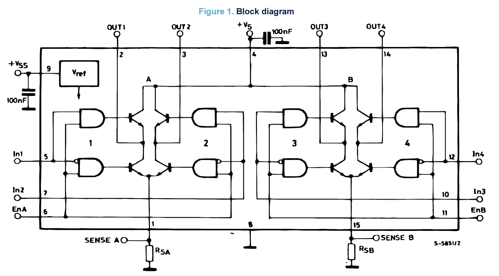

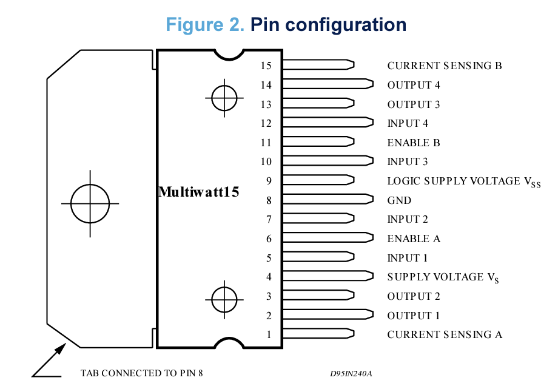

ENABLE A, IN 1, IN 2, OUTPUT 1, and OUTPUT 2 control the first motor. <br>
ENABLE B, IN 3, IN 4, OUTPUT 3, and OUTPUT 4 control the second motor.

The IN's control the direction of the motors. ENABLE's determine if the motor should be running of not. It is recommended to drive the ENABLE's with PWM to achieve speed control. OUTPUT's control the current outputing to the motors.

**TODO:**
- Assign MCU pins for programming
- Draft the wireless communication for the MCU

## March 04, 2024
### MCU Code: Code Struture and MCU Pin Assignments 

Files and brief:
- `esp32s3_control_new.ino`: main function, containing initial set up, MCU loop, and other main loop related variables/ helper functions/ handlers.
- `DCMotor.h`: a header file, containing a DCMotor class
- `DCMotor.cpp`: contains all function definitions of DCMotor class
- `Proj_Setup.h`: a header file, containing MACROS, enum, structures, and all helper functions in the projects
- `Proj_Setup.cpp`: contains all function definitions of helper functions and global variables 


Here is the finalized version of the pin assignments
```cpp
/**
  * DC Motor Control 
  * MT# = motor #
  * D1 and D2 are used for H-bridges control
  * D1 (out) - motor direction control 1
  * D2 (out) - motor direction control 2
  *
  * HALL_A and HALL_B are the pins for motor hall sensors, 
  * used for determining motor speed and direction
  * HALL_A (in) - hall sensor phase A
  * HALL_B (in) - hall snstor phase B
  *
  * PWM is the PWM signal for the motor driver, voltage/speed control 
  * PWM (out) - output 
  *
  */

// motor 1 control pins
#define MT1_D1      11
#define MT1_D2      12
#define MT1_PWM     13
#define MT1_HALL_A  16
#define MT1_HALL_B  18

// motor 2 control pins
#define MT2_D1      38
#define MT2_D2      35
#define MT2_PWM     14
#define MT2_HALL_A  17
#define MT2_HALL_B  21

/**
  * Linear Actuator
  * D1 and D2 are used for H-bridges control
  * D1 (out) - motor direction control 1
  * D2 (out) - motor direction control 2
  *
  * PWM is the PWM signal for the motor driver, voltage/speed control 
  * PWM (out) - output 
  *
  */
// linear actuator pins 
#define Ln_Act_D1   36
#define Ln_Act_D2   37
#define Ln_Act_PWM  15
```
The GPIOs listed here will connect to the corresponding components on the customized PCB.

In ESP32, the LED control (LEDC) peripheral is primarily designed to control the intensity of LEDs, but it can also be used to generate PWM signals. The PWM controller can automatically increase or decrease the duty cycle gradually, allowing for fades without any processor interference. We can control PWM output frequency, resolution, and channels of LEDC in setup to ensure that the PWM is tailored to the project's components. The library header is `esp32-hal-ledc.h`. In Arduino-ESP32 core, we can use `analogWrite` (a function in Arduino Analog I/O) to output PWM signals on a specific pin. However, the Arduino Analog I/O only has a few parameters can be configured. 

```cpp
/* PWM control section */

// PWM channels
#define CHAN_MT_ONE 1
#define CHAN_MT_TWO 2
#define CHAN_LN_ACT 3

// PWM control params
#define RESOL   8                 // resolution of the PWM signal
#define MT_FREQ 200               // motor channel frequency, this may not work
#define LA_FREQ 200               // linear actuator frequency
#define MAX_PWM pow(2, RESOL)-1   // the max duty cycle
```
**TODO:**
- Draft the wireless communication for the MCU

## March 09, 2024
### MCU Code: Wireless Communication Code

The wireless communication can be break into 3 steps:
1. MCU establishes a WiFi connection (with a device/router)
2. MCU creates a web server with different APIs 
3. MCU listens for requests coming from the client device (in the project, the client device is the Raspberry Pi)

**WiFi Connection**

Arduino IDE's built-in library `WiFi` can help ESP32S3 establish a WiFi connection with a router or make ESP32S3 a WiFi access point. The `WiFi` class has two modes `softAP` and `STA`.
- `softAP`: makes ESP32S3 a WiFi access point
- `STA`: ESP32S3 will connect to the WiFi router

`STA` is more suitable for the project. Since ESP32S3 is connected to a WiFi router, and the WiFi router's signal is strong, ESP32S3 can communicate with the WiFi router pretty much everywhere. 

The communication mechanism:
```txt
ESP32S3 <----- Data -----> Router <------ Data ------> Devices
```

The ESP32S3 module will start a web server and expose its IP address in the WiFi network. The devices under the same WiFi network can communicate with the ESP32S3 via ESP32S3's IP address. Here is how WiFi connection between ESP32S3 and router establishes:

```cpp
#include <WiFi.h>

const char * ssid = "IllinoisNet_Guest"; // wifi name of the wifi esp32s3 needs to connect
const char * pass = NULL;                // wifi password, if wifi does not have password, leave it null

void setup(){ 
  Serial.begin(9600);                    // setup serial with a baud rate, for serial printing
	WiFi.begin(ssid, pass);                 
	Serial.printf("Connecting to %s", ssid);
	while(!WiFi.isConnected()){            // attempt to connect
	  Serial.print(".");
	  delay(1000);
	}
	Serial.println();

  // output IP address of ESP32S3 in the current wifi network
	Serial.println("WiFi IP: ");
	Serial.println(WiFi.localIP());

  // some code for initialization (pin setup, motors, sensors, etc)
}

void loop(){
  // some code for ESP32S3 main loop
}
```

ESP32S3 cannot directly access UIUC's school network (`IllinoisNet_Guest` or `IllinoisNet`). To allow ESP32S3 to access UIUC's school network, ESP32S3 must be added to the device list under a student's account. To register ESP32S3 and add it to the device list, go to https://go.illinois.edu/illinoisnetguest and log in, click on "Register a New Device". The device registration requires the MAC address of the device. To get ESP32S3's MAC address, we can add a line in the `setup` function:
```cpp
Serial.println(WiFi.macAddress());
```

**Web Services**

The main communication protocol between ESP32S3 and the connected devices in the project is HTTP. It might not be the optimal solution, but it works. To optimize the performance of handling HTTP requests on ESP32S3, I created an async web server on the ESP32S3 using `ESPAsyncWebServer`. The advantage of this approach is that the async web server is managed by an event loop. The main program would not be blocked by the request handling of the async web server. In this case, the web server and main program (motor controls) can run concurrently on a single core of ESP32S3. ESP32S3 has two cores. Technically, I can create two threads (one for the main program and one for web services). The MCU code will be more complex and challenging because there is quite a lot of data shared between two threads and synchronization is required. It is also possible that the true multithread program might have a worse performance due to synchronization overhead and other reasons.

To create an async web server on ESP32S3, we need to include the library `ESPAsyncWebServer.h` in our program and then create an `AsyncWebServer` object:
```cpp
AsyncWebServer server(80); // start a web server at port 80, HTTP generally uses port 80
```

The device (Raspberry Pi) needs to control the movement and the lid of the bin. To make the control easier, I created a list of APIs:

- `stop_motors`<br>
  Description: Stop the movement of the bin (not include the lid movement)

  Parameters: None
  
  Response:
  - a json object containing current state `{state: "STOP" | "LID" }`

- `set_speed`<br>
  Description: Set the speed of motors for a specific duration. Left and right motors can adjust to different speed

  Parameters:
  - `duration`(long int): motor control duration in ms [optional, default: 0]
  - `speedLeft`(float): left motor speed [optional, default: 0]
  - `speedRight`(float): right motor speed [optional, default: 0]

  Response:
  - a json object containing current state `{state: "YOLO" | "LID" }`

- `set_lid`<br>
  Description: Open the lid of the bin
  
  Parameters: None

  response:
  - a json object containing current state `{state: "LID"}`
    
- `move`<br>
  Description: Move the bin forward or backward with a specific speed for a specific duration

  Parameters:
  - `duration`(long int): motor control duration in ms [optional, default: 5000]
  - `speed`(float): moving speed [optional, default: 0]
  - `direction`(string):  "forward"/"backward" [optional]

  Response:
  - a json object containing current state `{state: "FORWARD" | "BACKWARD" | "LID" }`
  
- `turn`<br>
  Description: Turn the bin left or right with a specific speed for a specific duration

  Parameters:
  - `duration`(long int): motor control duration in ms [optional, default: 5000]
  - `speed`(float): turning speed [optional, default: 0]
  - `direction`(string): "left"/"right" [optional]

  Response:
  - a json object containing current state `{state: "LEFT" | "RIGHT" | "LID" }`

*A design choice for state machine implementation later:* <br>
When `set_lid` is called, the main control program enters the state `LID`. In the `LID` state, any incoming requests will be blocked, and all handlers will respond `{state: "LID"}`. In the `LID` state, the bin must stop. The main control program will leave the `LID` state once the `LID` is completely closed.

Web services handlers on ESP32S3:
```cpp
// web service handlers
void handleRoot(AsyncWebServerRequest *);          // for connection testing
void handleStopMotors(AsyncWebServerRequest *);    // stop_motors
void handleSetSpeed(AsyncWebServerRequest *);      // set_speed
void handleLid(AsyncWebServerRequest *);           // set_lid
void moveForwardBackward(AsyncWebServerRequest *); // move
void turnLeftRight(AsyncWebServerRequest *);       // turn
```

Web services handler general definition in the project:
```cpp
void some_handler(AsyncWebServerRequest * request){
  // some local variables

  // request data parameter checking
  // depends on the API, the handler can have no  hecking or more than one checking
  if(request->hasParam("something", true)){
    // update control data based on the request data
  	something = request->getParam("something", true)->value().toInt();
  }

  // some updates on the control variables (global / local)

  // setting up response 

  request->send(200, "application/json", response);
}
```
Almost all handlers create a `JsonDocument` object. `JsonDocument` is a class in a library called `ArduinoJson.h`. This class makes JSON object creation much easier. When handlers need to send back a response, they can convert the JsonDocument to a JSON object string using the `serializeJson` function. 

Intialize all the APIs and start asyc web server:
```cpp

  // include this chunk of code in void setup(), after WiFi setup
	// async server handling
  server.on("/", HTTP_GET, handleRoot);
  server.on("/stop_motors", HTTP_POST, handleStopMotors);
  server.on("/set_speed", HTTP_POST, handleSetSpeed);
  server.on("/set_lid", HTTP_POST, handleLid);
  server.on("/move", HTTP_POST, moveForwardBackward);
  server.on("/turn", HTTP_POST, turnLeftRight);

  // turn on the web server 
	server.begin();
```

After doing all the setup, all devices in the same wifi network can interact with the web server on ESP32S3. To interact with the server, the device can send data via `http://ESP32S3_IP_ADDRESS/:path`. An easy way to verify whether the web server is working or not is to go to `http://ESP32S3_IP_ADDRESS/` on the laptop's browsers. This triggers the root handler of the ESP32S3 web server. The relative path of the root is `/`. The browser will show the text, "Welcome to ESP32-S3". Here is the definition of the root handler of the ESP32S3 web server:
```cpp
void handleRoot(AsyncWebServerRequest * request){ // use this for debugging I guess
  Serial.println("Request root");
  request->send(200, "html", "<h1>Welcome to ESP32-S3</h1>");
}
```
I am writing a Python script using `httpx` to interact with the ESP32S3 web server. The goal of the script is to test the functionalities and behaviors of the web server. 

**Additional materials:**
- An article on setting up connection between ESP32S3 and Router: [Link](https://www.upesy.com/blogs/tutorials/how-to-connect-wifi-acces-point-with-esp32)
- Arduino WiFi Reference: [Link](https://www.arduino.cc/reference/en/libraries/wifi/)
- ESPAsyncWebServer Reference: [Link](https://github.com/esphome/ESPAsyncWebServer)

**TODO:**
- Test all the web server APIs
- Write the motor control code

## March 13, 2024
### MCU Code: Wireless Communication Testing Part 1

Based on our plan, we can break down the testing plan as the following parts:
- Connecting to WiFi network and verifying if the IP Address can be `ping`
- Testing the async web server and see if the APIs receives the request and parse the request data

The first image shows that ESP32S3 has successfully connected to the wifi network. Devices under the same wifi network can ping the IP address of ESP32S3 (shown in the second image).

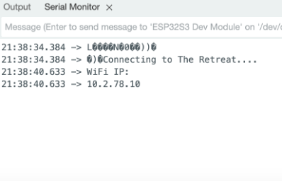
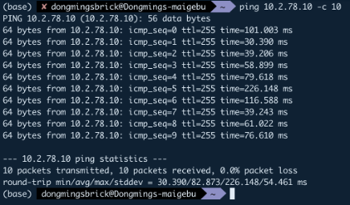

Then, we can move on and test the web service APIs once all the APIs are done.

**TODO:**
- Create control state machine for the trash bin system 
- Finish and test all the web service APIs

## March 16, 2024
### MCU Code: FSMs

The control flow of the MCU can be shown as a finite state machine. The main loop of the MCU will manage this finite state machine.

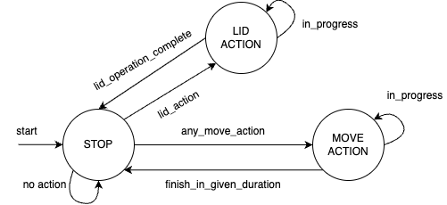

The MCU begins in the `STOP` state. Based on the client's requests, the MCU can only transition to `LID ACTION` or `MOVE ACTION` states. When MCU is in `LID ACTION` and `MOVE ACTION`, it only returns to `STOP` until the operation of the action is done. The duration of the operation is specified by the client. 

The `MOVE ACTION` state is broken down into 5 operations: `FORWARD`, `BACKWARD`, `LEFT`, `RIGHT`, and `YOLO`. To command the MCU to perform one of the operations, the client needs to format the request accordingly and call the appropriate APIs provided by the MCU. The first 4 operations, as the state name suggested, move the trash bin forward/backward or turn the trash bin to the left/right. `YOLO` is a special operation that allows the client to adjust the speed of each motor independently, and accomplish more flexible motion, for example, moving the trash bin diagonally.

In the project design, once the trash bin is close to the user. The trash bin will open the lid, hold the lid open for about 30 seconds, and close the lid. The `LID ACTION` state presents this sequence of operations. When the MCU is in `LID ACTION`, it rejects other operations until it returns to the `STOP` state. Since the `LID ACTION` has a sequence of operations, it can also be shown as a state machine.

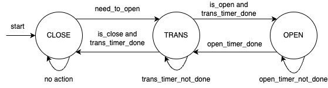

The MCU lid control begins with the `CLOSE` state, sets the `is_open` flag, and unsets the `is_close` flag. Once the client requests to use the lid, the control transitions to the `TRANS` state via `need_to_open`. Since both `CLOSE` and `OPEN` can transition to `TRANS` and `TRANS` can go to either state after finishing its timer countdown, `is_open` and `is_close` flags are in use to help the `TRANS` state determine the next state it needs to go. To avoid ambiguity, both flags cannot be set simultaneously (i.e., both flags cannot be both `false`/`true`). With a set `is_open` flag, `TRANS` moves to `OPEN`. With a set `is_close` flag, `TRANS` moves to `CLOSE`. In the `OPEN` state, the MCU unsets the `is_open` flag and sets the `is_close` flag. After the timer countdown is complete, `OPEN` moves back to `TRANS`, and then `TRANS` moves back to `CLOSE`.

The code of the main state machine is in the `loop` function in `esp32s3_control_new.ino`.<br>
The code of the lid operation state machine is in the `checkLid` function in `Proj_Setup.cpp`.

## March 26, 2024 
### Debug Customized PCB: Unable to Upload code to MCU with USB-to-UART

The customized PCB's auto program circuit (UART circuit) is correct. the MCU could not be programmed because I connected the TX/RX on the UART bridge to the wrong ports on the MCU UART. 

The correct connection when programming with USB-to-UART:
- USB-to-UART bridge TX <---> MCU RX
- USB-to-UART bridge RX <---> MCU TX

`RTS` and `DTR` pins must be connected to ensure that the serial communication between the MCU and the laptop. For debugging purpose, I used the serial monitor in Arduino IDE to verify that the MCU is communicating with the PC/laptop.

**TODO:**
- Debug Mirco-USB programming for MCU. MCU still cannot communicate/program via Micro-USB

## March 29 to March 31, 2024
### MCU Code: Motor Control - PID tunning

The motor control need to react quickly to the change in the set point (target) and generate a smooth transition from one speed to another. 

I do not know how to dynamically tuning my PID, so I just use the classic method: trial and error.

Motor model: 12V JGB37-520 178 RPM <br>
Hall Encoder PPR: 11 <br>
Reduction Ratio: 56 <br>
PID sample interval: 100ms

The testing script `pid_analysis.ipynb` can be found in `debugging` directory. The trial data (in `csv` format) can be found in `debugging/pid_data` directory.

The order of tuning parameters: P -> D -> I<br>
Below ared some results with different P, D, I

$P = 1.1$

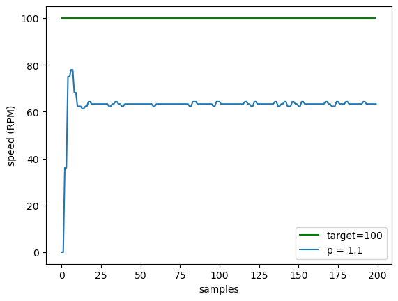

$P = 1.25$

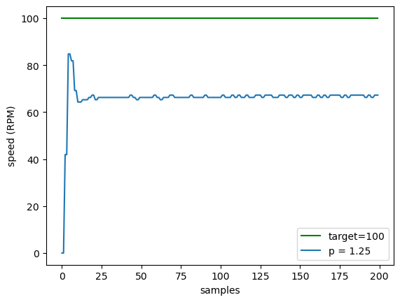

Increase P to reach some sort of damping <br>
$P = 2.3, D=0.0001$

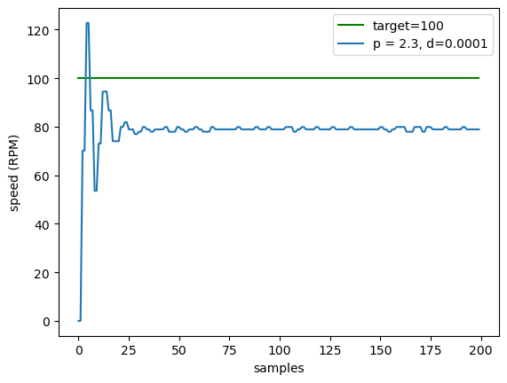

Tuning based on $P = 2.3, D=0.0001$ <br> 
$P = 2.3, D = 0.05$

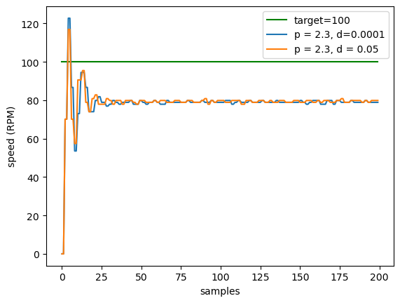

$P = 2.3, D = 0.075$

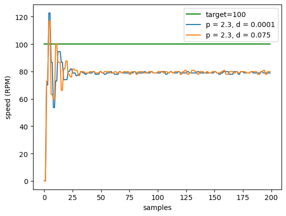

$P = 2.3, D = 0.125$

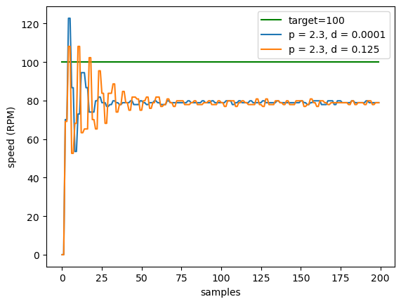

$P = 2.3, D = 0.1$

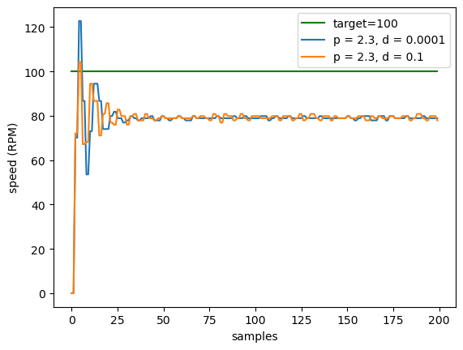

The P might be aggressive, reducing P to 1.15 <br>
$P = 1.15, D = 0.1$

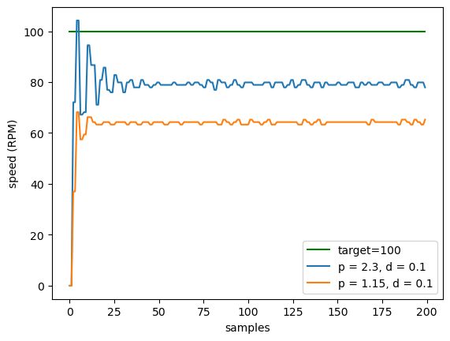

Using $P = 1.15, D = 0.1$ as a reference and comparing the differences

$P = 1.15, D = 0.15$

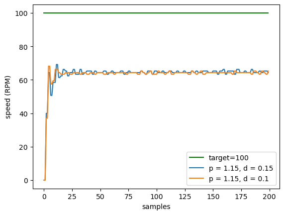

$P = 1.15, D = 0.11$

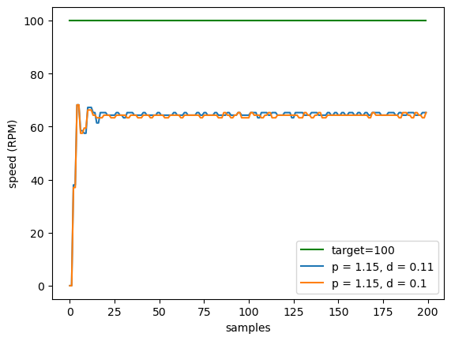

$P = 1.15, D = 0.105$

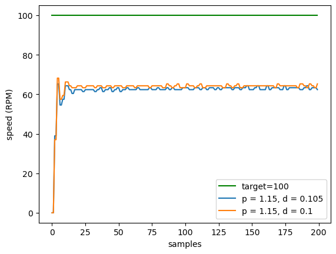

$P = 1.15, D = 0.08$


With $P \geq 1$, the resulting curve will always have a sudden jump at the beginning. When $P \lt 1$, the sudden jump at the beginning becomes less. The sweet spot of P is around 0.8. The P can quickly respond to errors without creating a sudden jump at the beginning. With $P \approx 0.8$, the D should be around 0.04 to smooth out the sudden jump.

Then, for I, a good one is between 4 and 8. It can quickly lift the PID output to the setpoint. With a greater I and anti-windup, the PID responds faster.

The finalized PID curve with $P=0.8, I=4, D=0.041$

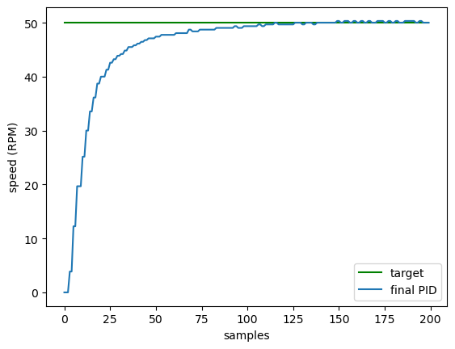

Although the left and right motors might not be the same, but these set of PID parameters can produce similar outputs

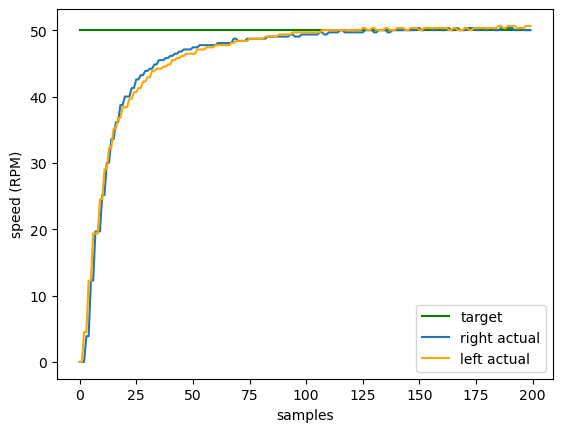

At this point, the PID tuning is completed. Although the PID is tuned based on the 178 RPM motor, it works well on our 60 RPM motor. The probable reason is that the two motors are the same model but with different gear ratios.

**TODO:**
- Step down setpoint when motors cannot meet the setpoint due to various reasons

## April 05, 2024
### PCB Testing: PCB v1

Tested the first version of the customized PCB.

Checklist of working components
- [x] ESP32S3 chip 
- [x] UART code uploading
- [x] reset and boot button (boot button is fried due to soldering, needs to be replaced)  
- [x] power subsystem
- [x] motor one port of the motor driver
- [ ] motor two port of the motor driver
- [x] linear actuator motor driver  
- [ ] Micro-USB communicates with ESP32S3 module 

Motor driver port 2 does not output power to the motor even though the MCU is sending PWM and H-bridge control signals.


## April 08, 2024
### PCB Testing: PCB v1 motor driver port two

Continued testing the first version of the customized PCB with Josh, my EE teammate 

We successfully debugged the issue with motor two port of the motor driver. We found out that the B-sense pin of L298 was not grounded. Because of this, the motor driver outputed 12V to both the positive and negative ports of the motor. The version 1 of the PCB did not have any connection from B-sense to ground, so we solder a jumper from B-sense to the ground of the L298 chip. 

We also tried to debug the micro-usb communication, but we couldn't find enough information to help us debugging this. The pin connections are correct. The Arduino IDE settings are adjusted accordingly. However, neither of our laptops recognizes the USB connection with ESP32S3. 

Checklist of working components
- [x] ESP32S3 chip 
- [x] UART code uploading
- [x] reset and boot button (boot button is fried due to soldering, needs to be replaced)  
- [x] power subsystem
- [x] motor one port of the motor driver
- [x] motor two port of the motor driver
- [x] linear actuator motor driver  
- [ ] Micro-USB communicates with ESP32S3 module (do not know what is going, very unfortunate)

### Project Design: Minor Update on Physical Design

We asked the machine shop to drill a couple of holes in the battery box. We now can pass the power wires from the side and motor wires from the bottom of the base to our PCB, which will sit on top of the battery box. 

For micro-USB communication, all the connections are fine. However, the laptops cannot recognize the USB driver on the ESP32S3. Maybe there are some specific settings we need to pay attention to.

The Plan for project design:
- Get a 3D printed box for the PCB (for hiding wires)

The Plan for project testing:
- Assemble everything
- Run the web service control and motor driver control at the same time
- Make necessary adjustments

## April 10, 2024
### Project Production: Assembling and Testing

Josh and I assembled all parts of the trash bin system.

Checklist for assembling:
- [x] Battery is locked in the battery box 
- [ ] Battery is fixed at a position (may use some dual lock fasteners)
- [x] All wires are connected to the PCB (except the power)
- [ ] 3D printed / cardboard box for PCB 
- [ ] Wire coverage
- [ ] Wire connection re-arrangement
  
We also verified the functionalities of the trash bin system. The ESP32S3 on our PCB can connect to the wifi network successfully. It can receive and quickly process requests from other devices.

## EXTRA NOTE
Note: the commit history might not be the same as the timeline here... the dev log might be earlier or later than the commit history. But they are almost aligned.
